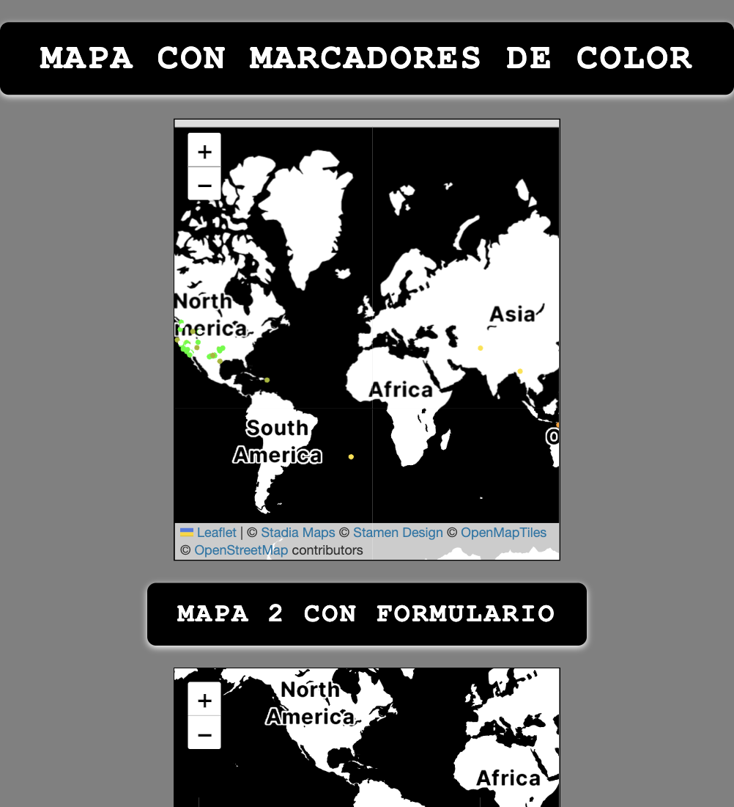
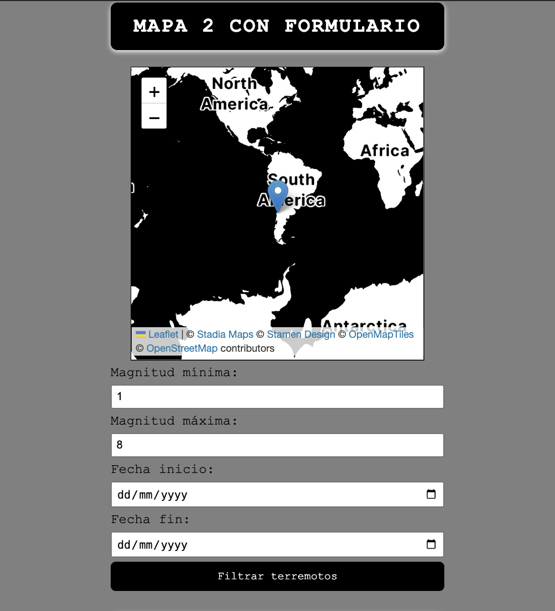
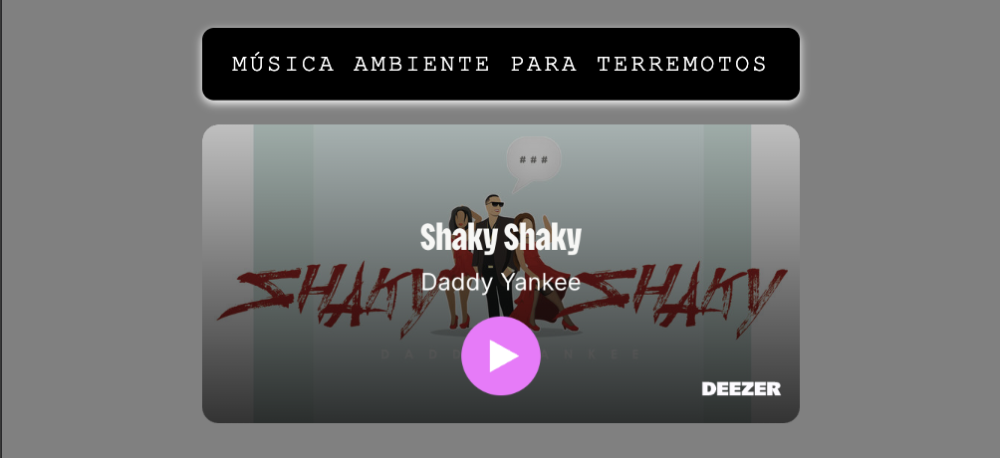

# ## Proyecto QUIZ
Este proyecto consiste en una web que muestra en un mapa los movimientos telúricos del día, la cual cuenta con mapas de Leaflet, en ella se encuentra un segundo mapa, en el cual se puede interactuar mediante un formulario que permite elegir fechas y magnitudes, las cuales serán representadas en el mapa inferior.

Los objetivos principales eran lograr marcas de colores según magnitud en el primer mapa las cuales se obtenían desde la API de USGS y en el segundo mapa, usando la misma API lograr un formulario funcional para marcar mediante Pin los sismos registrados en determinada fecha (a elegir por el usuario) y las magnitudes.

##Tecnologías usadas
-HTML5
-CSS3
-JavaScript

## :dart: Objetivo del proyecto
-Usar la estructura semántica de HTML5
-Crear un diseño responsive adaptado a movil
-Dar funcionalidad aplicando la lógica de JavaScript.

## Capturas de pantalla

## :rocket: Cómo ejecutar el proyecto
1. Clonar repositorio de GitHub
git clone [https://github.com/fernanbga/LEAFLETSUPREMO]
2. Abrir el archivo `index.html` en el navegador
### :globe_with_meridians: Proyecto desplegado
Puedes ver el proyecto online en:
[https://nazaretmelquiades.github.io/Proyecto-quiz/]
## :books: Lecciones aprendidas
- Hay que manejar conceptos avanzados de FrontEnd.
- Integrar datos de una API, tratar los datos para poder usarlos.

## :open_file_folder: Estructura del proyecto
css - hoja de estilos principal
normalize - homogeneizar la forma en que los navegadores interpretan elementos HTML
index.html - archivo principal
script.js - funcionalidades
README.md - documentación
## :technologist: Autor
- Nombres: Fernán Burgos
# :Créditos
A mis compañeros por el apoyo y al Profesor!
# LEAFLETSUPREMO